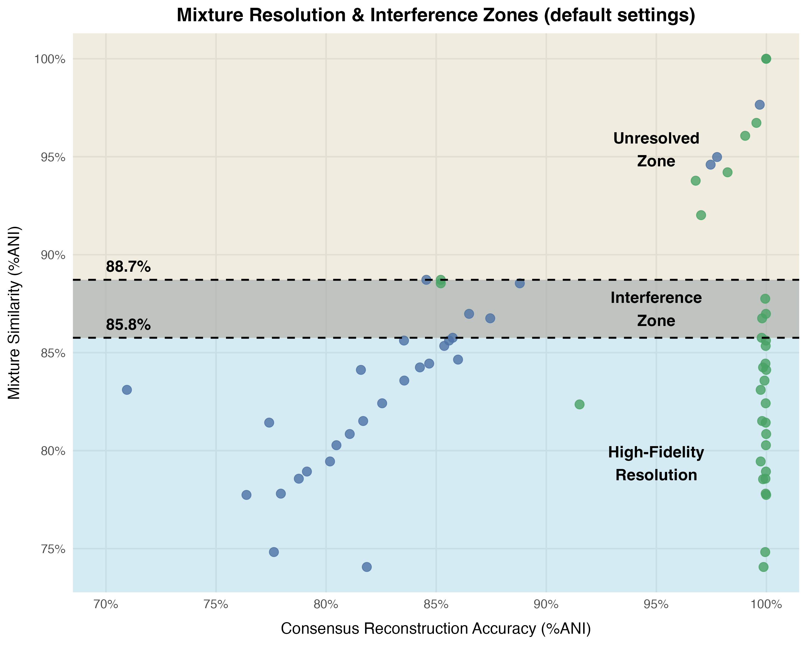

# Resolving genome mixtures

This setup was used to see the detection sensitivity of viralmetagenome on mixtures of viral genomes.

## References:

HIV as a an example, easily lot of variation in the genome.

Went to ncbi & downloaded a random subset of 2 000 sequences [available viruses under the name of 'Human immunodeficiency virus 1'](https://www.ncbi.nlm.nih.gov/labs/virus/vssi/#/virus?SeqType_s=Nucleotide&VirusLineage_ss=Human%20immunodeficiency%20virus%201,%20taxid:11676)

I picked a random complete genome as a representative: MN090277.1

## Selecting genomes with different similarity to the representative

I mapped out the ANI towards the represnentative genome, based on their similarity we selected genomes with a 0.01 difference in similarity:

- [Strain_selection](00_strain_selection.ipynb)

## Mixed sample generation

Sample mixtures were generated with inSilicoSeq (iss) by making coverage tables for every combination of representative and reference genome:

- representative genome 50x
- second genome 50x

- [Read_generation](01_generate_reads.slurm)

## Run viralmetagenome on the different mixtures

- [Viralmetagenome_run](02_run-viralmetagenome.slurm)

output stored in [`pipeline-output`](./pipeline-output/)

## Determine the global ANI of all consensus genomes

- [determine GANI](03_determine_GANI.nf)

## Sample separation analysis

Checking at which thresholds, the pipeline starts to distinguish the different strains in the mixture.

- [Sample_seperation_analysis](04_sample_seperation.ipynb)

