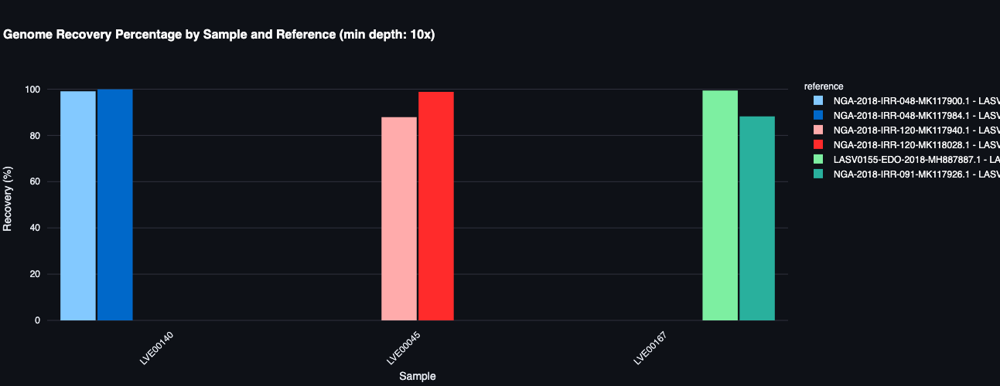
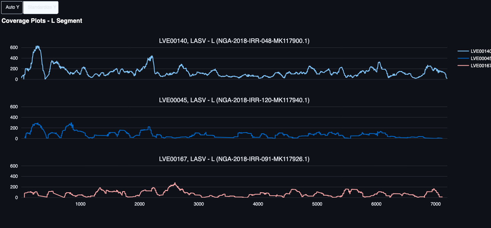

# Influence of reference selection

This setup was used to evaluate how reference genome scaffolding affects consensus assembly quality using real sequencing data from LASV samples.

## Selecting samples and candidate references

Downloaded all genomes from NCBI virus [under the name of 'Mammarenavirus Lassaense'](https://www.ncbi.nlm.nih.gov/labs/virus/vssi/#/virus?SeqType_s=Nucleotide&VirusLineage_ss=Mammarenavirus%20lassaense,%20taxid:3052310) and computed pairwise similarity using mmseqs2 to previously determined consensus genomes to identify a range of reference genomes with varying ANI to selected samples.

- [Reference_selection](00_reference_selection.ipynb)

Made sure that the coverage for some samples was not good

## Run viralmetagenome with different reference pools

Specified selected references as scaffolding references for viralmetagenome and ran them across samples with varying reference similarity.

- [Viralmetagenome_run](01_viralmetagenome.slurm)

## Determine the global ANI of all consensus genomes

Computed global alignment statistics between consensus genomes and the previously defined consensus sequences (those ran with RVDB).

- [determine GANI](02_determine_GANI.nf)

## Visualize reference impact on consensus quality

Analyzed how reference ANI affects consensus genome quality and accuracy compared to database sequences.

- [Plotting_analysis](03_plotting.ipynb)